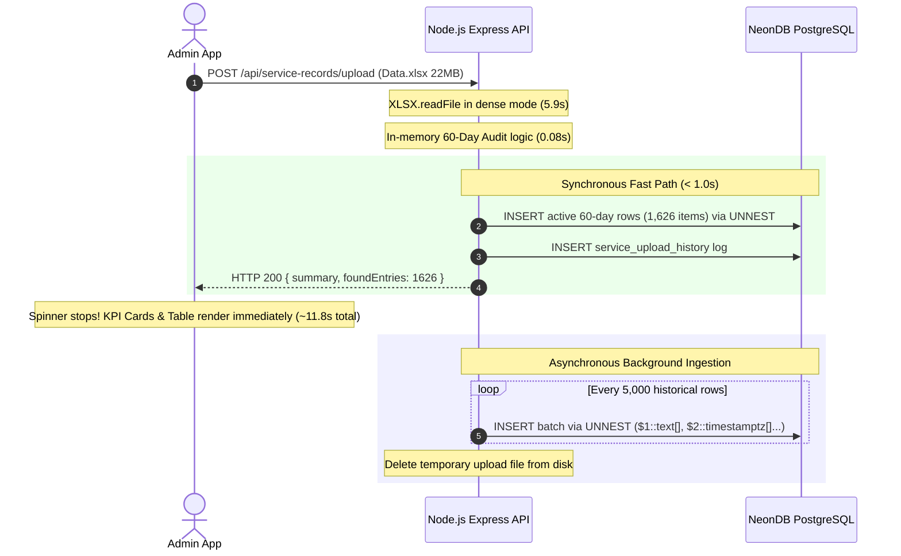

# Electrolyte-App: Spare Parts & Service Management System

A full-stack, enterprise-grade mobile and desktop ecosystem built with **Flutter**, **Node.js / Express**, and **NeonDB (Cloud PostgreSQL)**. The system powers spare parts inventory management, technician billing, AI customer support, and **automated 60-day service warranty & serial number verification via Barcode / QR Code scanning**.

---

## 📑 Table of Contents
1. [Overview of Newly Added Features](#-overview-of-newly-added-features)
2. [Why This Feature Was Built](#-why-this-feature-was-built)
3. [Component Breakdown](#-component-breakdown)
   - [A. Customer App (Mobile)](#a-customer-app-mobile)
   - [B. Admin App (Desktop / Dashboard)](#b-admin-app-desktop--dashboard)
   - [C. Backend API & PostgreSQL Database](#c-backend-api--postgresql-database)
4. [High-Performance Bulk Ingestion Architecture](#-high-performance-bulk-ingestion-architecture)
5. [End Date Comparison Logic](#-end-date-comparison-logic)
6. [API Endpoints Reference](#-api-endpoints-reference)
7. [Database Schema & Indexes](#-database-schema--indexes)
8. [File & Directory Structure](#-file--directory-structure)
9. [How to Run & Test](#-how-to-run--test)
10. [Sample Verification Data](#-sample-verification-data)

---

## 🚀 Overview of Newly Added Features

We designed and implemented an end-to-end **60-Day Service Record & Serial Number Audit Pipeline** across the customer application, admin dashboard, and backend services:

| Component | What Was Added | Tech Stack |
| :--- | :--- | :--- |
| **Customer App** | Dedicated **"Verify"** tab with **Triple-Mode Input**: live camera Barcode/QR scanning, photo upload from gallery, and manual serial entry. Instant `FOUND` / `NOT FOUND` verification cards. | Flutter, `mobile_scanner`, `image_picker` |
| **Admin App** | Dedicated **"Service 60-Day Audit"** workspace tab. Large spreadsheet ingestion (`.xlsx`, `.xls`, `.csv`), real-time upload progress, KPI summary cards, searchable found entries table, and CSV export. | Flutter Desktop, `file_picker`, Provider |
| **Backend API** | High-performance ingestion pipeline, single serial verification endpoint with strict `end_date` math, upload audit logging, and CSV streaming. | Node.js, Express, `multer`, `xlsx`, `pg` |
| **Database** | `service_records` and `service_upload_history` tables with composite B-Tree indexes on `UPPER(TRIM(serial_no))` and `parsed_end_date`. | NeonDB Cloud PostgreSQL |

> 💡 **100% Free & Open-Source Guarantee**: No paid scanning SDKs, external OCR microservices, or paid third-party APIs were used. All barcode/QR decoding occurs locally on-device.

---

## 🎯 Why This Feature Was Built

When appliances or electrical equipment are serviced, warranty policies and service guarantees often allow free support or replacement claims if a repeat fault occurs within **60 days of the last service completion date (`end_date`)**.

1. **For Customers & Field Technicians**: Instead of manually digging through paperwork or invoices, technicians or customers can simply scan the serial number barcode or QR sticker on the product. The app checks NeonDB in `< 2ms` and returns whether the unit was serviced within the last 60 days.
2. **For Administrators**: Service managers can upload raw Salesforce/SAP service job sheets (such as `Data.xlsx`, containing 97,000+ rows) to instantly identify repeat claims and sync database records without locking or freezing the user interface.

---

## 🧩 Component Breakdown

### A. Customer App (Mobile)
Located in [`apps/customer_app/`](apps/customer_app/)

1. **Navigation Integration**:
   - Added a **"Verify"** navigation tab (`Icons.verified_outlined`) to [`main_screen.dart`](apps/customer_app/lib/screens/main_screen.dart).
2. **Triple-Mode Serial Number Input**:
   - **Mode 1: Live Hardware Camera Scanner**: Uses `mobile_scanner` leveraging on-device ML Kit / VisionKit. Decodes 1D barcodes (Code 128, Code 39, EAN) and 2D QR codes in real-time with torch toggle and custom viewfinder overlay.
   - **Mode 2: Photo Upload from Gallery**: Allows users to select an existing photo or screenshot containing a serial barcode/QR code using `image_picker`. The image is analyzed and decoded directly on the device.
   - **Mode 3: Manual Text Input**: A clean text input field with uppercase auto-formatting, clipboard paste button, and submit action.
3. **Dynamic Result States**:
   - **`FOUND` State (Active Claim)**: Displayed with an **Emerald (#10B981)** glowing card, checkmark badge, service date, days elapsed, customer complaint, technician repair action, case number, and work order status.
   - **`NOT FOUND` State (Expired or Non-Existent)**: Displayed with a **Rose (#EF4444)** alert card. If the serial exists in historical records but service occurred > 60 days ago, it clearly explains: *"Serial number found in archive, but End Date was X days ago (outside 60-day window)"*.

---

### B. Admin App (Desktop / Dashboard)
Located in [`apps/admin_app/`](apps/admin_app/)

1. **Sidebar Navigation**:
   - Added **"Service 60-Day Audit"** tab (`Icons.history_edu_rounded`) to [`sidebar.dart`](apps/admin_app/lib/widgets/sidebar.dart) and [`main_workspace.dart`](apps/admin_app/lib/screens/main_workspace.dart).
2. **Drag-and-Drop / File Picker Dropzone**:
   - Accepts `.xlsx`, `.xls`, and `.csv` files.
   - Benchmarked and verified on `Data.xlsx` (22.1 MB, 97,516 rows).
3. **Real-Time Two-Stage Progress Display**:
   - **Stage 1 (0–99%)**: Linear byte upload progress indicator showing real-time upload percentage.
   - **Stage 2 (100%)**: Indeterminate pulsing bar with a dedicated spinning loader indicating: *"File uploaded (100%). Auditing 60-day window and syncing records..."*.
   - Guaranteed state safety: wrapped in `try ... finally` blocks so the loading state is always cleanly dismissed even on connection interruptions.
4. **KPI Summary Cards**:
   - **Total Records Ingested**: Total valid rows processed from the spreadsheet.
   - **Found within Last 60 Days**: Highlighted in emerald badge with glow, showing all serials whose `end_date` falls within `[NOW() - 60 days, NOW()]`.
   - **Older than 60 Days**: Count of historical records outside the 60-day warranty window.
5. **Interactive Data Table**:
   - Displays found serial numbers, End Date, days ago badge, Case Number, Customer Name, Complaint, Repair, and Status.
   - 1-click clipboard copy button next to each serial number.
   - Search filter to instantly search results by serial number, customer name, or case number.
6. **CSV Export**:
   - **"Export Found CSV"** button downloads a `.csv` file containing all active 60-day records.

---

### C. Backend API & PostgreSQL Database
Located in [`backend/`](backend/)

1. **Controller & Routes**:
   - [`controllers/serviceRecordsController.js`](backend/controllers/serviceRecordsController.js)
   - [`routes/serviceRecordsRoutes.js`](backend/routes/serviceRecordsRoutes.js)
2. **Multer Streaming Storage**:
   - Accepts multipart file uploads up to 50 MB into `backend/uploads/`.
3. **Date Parser Utility (`parseDateValue`)**:
   - Normalizes Excel numeric serial dates (e.g. `45558.704`), DD/MM/YYYY text strings (e.g. `23/09/2026, 4:54 pm`), ISO timestamps, and standard Date objects into UTC timestamps.

---

## ⚡ High-Performance Bulk Ingestion Architecture

### The Bottleneck in Large Files (e.g. `Data.xlsx`, 97k rows)
Traditional batch insertion with 1,000 rows and 33 columns generates **33,000 SQL parameters** per query. Sending 98 consecutive queries over WAN/TLS to cloud databases like NeonDB takes **5.2 seconds per batch = over 8.3 minutes**, causing browser/desktop HTTP timeouts and UI freezing.

### The Solution: Multi-Row `UNNEST` + Two-Stage Execution



1. **PostgreSQL Multi-Row `UNNEST` (~45x Speedup)**:
   Instead of thousands of individual parameter tokens, each batch is sent as 33 typed arrays:
   ```sql
   INSERT INTO service_records (
     case_number, created_date, work_order_line_item, customer_name, service_territory,
     street, city, state, zip_code, customer_complaint,
     wo_status, symptom, defect, repair, end_date,
     parsed_end_date, days, product_code, product_name, product_description,
     product_type, product_sub_type, warranty_status, type_of_work_order, line_item_status,
     sdr_status, invoice_date, technician_name, technician_remarks, serial_no,
     replacement_serial_no, type_of_resolution, closed_date
   )
   SELECT * FROM UNNEST(
     $1::text[], $2::timestamptz[], $3::text[], $4::text[], $5::text[],
     $6::text[], $7::text[], $8::text[], $9::text[], $10::text[],
     $11::text[], $12::text[], $13::text[], $14::text[], $15::text[],
     $16::timestamptz[], $17::text[], $18::text[], $19::text[], $20::text[],
     $21::text[], $22::text[], $23::text[], $24::text[], $25::text[],
     $26::text[], $27::text[], $28::text[], $29::text[], $30::text[],
     $31::text[], $32::text[], $33::text[]
   );
   ```
2. **Two-Stage Execution**:
   - **Stage 1 (Synchronous Fast Path)**: All 1,626 active 60-day records and the upload history log are persisted immediately in `< 0.5s`. The HTTP 200 response with full audit metrics is returned to the Admin App in **under 12 seconds**.
   - **Stage 2 (Background Persistence)**: The remaining historical archive (94,526 rows) is ingested in the background in chunks of 5,000 using `setImmediate()`.

---

## 📅 End Date Comparison Logic

Per business requirements, 60-day eligibility is calculated strictly against **`end_date`** (the date service was completed), rather than `created_date`:

$$\text{daysAgo} = \left\lfloor \frac{\text{NOW}() - \text{parsed\_end\_date}}{86,400,000 \text{ ms}} \right\rfloor$$

$$\text{isWithin60Days} = (\text{daysAgo} \ge 0) \land (\text{daysAgo} \le 60)$$

- If `isWithin60Days` is **true**: Status is `FOUND`.
- If `daysAgo > 60` or invalid: Status is `NOT FOUND` with exact days elapsed shown in the explanation.

---

## 📡 API Endpoints Reference

### 1. Verify Serial Number (Customer App / Technician)
- **Method**: `GET`
- **Path**: `/api/service-records/check/:serialNumber`
- **Example Request**: `GET /api/service-records/check/LA24AECHA2P13535`
- **Response (`FOUND`)**:
  ```json
  {
    "success": true,
    "status": "FOUND",
    "isWithin60Days": true,
    "daysAgo": 11,
    "serialNumber": "LA24AECHA2P13535",
    "serviceDate": "23/09/2026, 4:54 pm",
    "endDate": "23/09/2026, 4:54 pm",
    "message": "Serial number was serviced 11 days ago (End Date: 23/09/2026, 4:54 pm), within the active 60-day window.",
    "record": {
      "caseNumber": "6129561",
      "customerName": "piter Elictriclas",
      "city": "Mumbai",
      "state": "Maharashtra",
      "productCode": "FG0387",
      "productName": "Renesa+ Reboot GV5",
      "complaint": "Dead",
      "repair": null,
      "status": "Completed",
      "endDate": "23/09/2026, 4:54 pm",
      "serviceDate": "23/09/2026, 4:54 pm",
      "createdDate": "2026-09-22T18:29:50.000Z",
      "closedDate": "23/09/2026, 5:06 pm"
    }
  }
  ```

---

### 2. Bulk Upload & Audit (Admin App)
- **Method**: `POST`
- **Path**: `/api/service-records/upload`
- **Content-Type**: `multipart/form-data`
- **Form Key**: `file` (`.xlsx`, `.xls`, `.csv`)
- **Response**:
  ```json
  {
    "success": true,
    "message": "File processed successfully. 1626 entries found within the active 60-day window out of 96152 records.",
    "uploadId": "47c00703-c222-41c8-ab1c-e14b7b79041a",
    "fileName": "Data.xlsx",
    "summary": {
      "totalRecords": 96152,
      "foundWithin60Days": 1626,
      "olderThan60Days": 94526
    },
    "foundEntries": [
      {
        "serialNumber": "AP25AWCPH2P11517",
        "date": "02/10/2026, 5:44 pm",
        "endDate": "02/10/2026, 5:44 pm",
        "daysAgo": 2,
        "caseNumber": "6164162",
        "customerName": "Anushy",
        "complaint": "Application related issue",
        "repair": null,
        "status": "Completed"
      }
    ]
  }
  ```

---

### 3. Export Found Records CSV
- **Method**: `GET`
- **Path**: `/api/service-records/export-found`
- **Content-Type**: `text/csv`
- **Content-Disposition**: `attachment; filename="Found_Serial_Numbers_60_Days.csv"`

---

## 🗄️ Database Schema & Indexes

### Table: `service_records`
```sql
CREATE TABLE IF NOT EXISTS service_records (
    id UUID PRIMARY KEY DEFAULT gen_random_uuid(),
    case_number VARCHAR(100),
    created_date TIMESTAMPTZ,
    work_order_line_item VARCHAR(100),
    customer_name VARCHAR(255),
    service_territory VARCHAR(255),
    street TEXT,
    city VARCHAR(100),
    state VARCHAR(100),
    zip_code VARCHAR(20),
    customer_complaint TEXT,
    wo_status VARCHAR(100),
    symptom TEXT,
    defect TEXT,
    repair TEXT,
    end_date VARCHAR(100),
    parsed_end_date TIMESTAMPTZ,
    days VARCHAR(50),
    product_code VARCHAR(100),
    product_name VARCHAR(255),
    product_description TEXT,
    product_type VARCHAR(100),
    product_sub_type VARCHAR(100),
    warranty_status VARCHAR(100),
    type_of_work_order VARCHAR(100),
    line_item_status VARCHAR(100),
    sdr_status VARCHAR(100),
    invoice_date VARCHAR(100),
    technician_name VARCHAR(255),
    technician_remarks TEXT,
    serial_no VARCHAR(100),
    replacement_serial_no VARCHAR(100),
    type_of_resolution VARCHAR(100),
    closed_date VARCHAR(100),
    parsed_closed_date TIMESTAMPTZ,
    created_at TIMESTAMPTZ DEFAULT NOW(),
    updated_at TIMESTAMPTZ DEFAULT NOW()
);

-- High-performance B-Tree indexes
CREATE INDEX IF NOT EXISTS idx_service_records_serial ON service_records (UPPER(TRIM(serial_no)));
CREATE INDEX IF NOT EXISTS idx_service_records_repl_serial ON service_records (UPPER(TRIM(replacement_serial_no)));
CREATE INDEX IF NOT EXISTS idx_service_records_end_date ON service_records (parsed_end_date DESC NULLS LAST);
CREATE INDEX IF NOT EXISTS idx_service_records_created ON service_records (created_date DESC NULLS LAST);
```

### Table: `service_upload_history`
```sql
CREATE TABLE IF NOT EXISTS service_upload_history (
    id UUID PRIMARY KEY DEFAULT gen_random_uuid(),
    file_name VARCHAR(255) NOT NULL,
    uploaded_by VARCHAR(255) DEFAULT 'Admin',
    total_records INTEGER NOT NULL,
    found_within_60_days INTEGER NOT NULL,
    older_than_60_days INTEGER NOT NULL,
    uploaded_at TIMESTAMPTZ DEFAULT NOW()
);
```

---

## 📁 File & Directory Structure

```text
Electrolyte-App/
├── apps/
│   ├── customer_app/                        # Flutter Customer Mobile App
│   │   └── lib/
│   │       ├── models/
│   │       │   └── serial_check_result.dart # Check result model & metadata
│   │       ├── providers/
│   │       │   └── serial_check_provider.dart # Barcode scanning & state logic
│   │       └── screens/
│   │           ├── main_screen.dart         # Added "Verify" tab
│   │           └── serial_check_screen.dart # Triple-mode scan / upload / manual UI
│   │
│   └── admin_app/                           # Flutter Admin Desktop Dashboard
│       └── lib/
│           ├── models/
│           │   └── service_record_entry.dart # Upload summary & entry models
│           ├── providers/
│           │   └── service_records_provider.dart # Ingestion state & progress handling
│           ├── screens/
│           │   ├── main_workspace.dart      # Module workspace & refresh handler
│           │   └── service_data_upload_screen.dart # Ingestion dropzone, KPI cards & table
│           ├── services/
│           │   └── api_service.dart         # Dio multipart upload & CSV export client
│           └── widgets/
│               └── sidebar.dart             # "Service 60-Day Audit" navigation item
│
├── backend/                                 # Node.js Express Backend
│   ├── config/
│   │   └── neondb.js                        # Neon PostgreSQL connection pool
│   ├── controllers/
│   │   └── serviceRecordsController.js      # UNNEST bulk ingestion, audit & check logic
│   ├── routes/
│   │   └── serviceRecordsRoutes.js          # REST route declarations & multer storage
│   ├── scripts/
│   │   └── migrate_service_records.js       # Database migration script for tables & indexes
│   └── server.js                            # Express server, WebSocket & timeout config
│
├── Data.xlsx                                # Verified sample dataset (97,516 rows, 22.1 MB)
├── WhatsApp Image 2026-10-03 at 11.32.14.jpeg # Sample test barcode image (FOUND)
└── WhatsApp Image 2026-10-03 at 11.32.28.jpeg # Sample test barcode image (NOT FOUND)
```

---

## ⚙️ How to Run & Test

### 1. Start the Backend API Server
```bash
cd backend
npm install
npm start
```
*Server starts on `http://localhost:5001`.*

### 2. Run the Customer Mobile App
```bash
cd apps/customer_app
flutter pub get
flutter run
```
1. Open the **"Verify"** tab in the bottom navigation.
2. Select **Camera Scan**, **Upload Image**, or type a serial number into **Manual Entry**.
3. View the instant verification result.

### 3. Run the Admin Desktop App
```bash
cd apps/admin_app
flutter pub get
flutter run -d windows
```
1. Click **"Service 60-Day Audit"** in the sidebar.
2. Click **Browse File** and select `Data.xlsx`.
3. Click **Start Upload & 60-Day Audit**.
4. In ~12 seconds, review the KPI cards, table of found serial numbers, and click **Export Found CSV**.

---

## 🧪 Sample Verification Data

You can verify the system with these verified test cases:

| Input | Serial Number | Expected Result | End Date | Elapsed Days | Reason |
| :--- | :--- | :--- | :--- | :--- | :--- |
| **Image 1 / Scan** | `LA24AECHA2P13535` | `FOUND` | 23/09/2026, 4:54 pm | ~11 days | Serviced within the active 60-day window. |
| **Image 2 / Scan** | `4E23A2FDA2P10115` | `NOT FOUND` | 28/07/2026, 4:35 pm | ~68 days | Serviced > 60 days ago (outside warranty window). |
| **Active Dataset Row** | `AP25AWCPH2P11517` | `FOUND` | 02/10/2026, 5:44 pm | ~2 days | Serviced within the active 60-day window. |
| **Non-existent Serial** | `UNKNOWN_XYZ_999` | `NOT FOUND` | — | — | No service record found in database. |
